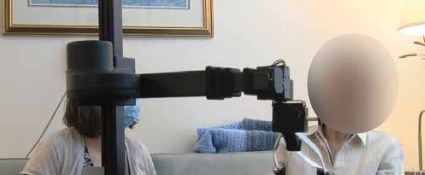

## Assistive Robots for Older Adults
The combination of a rapidly aging population and growing shortage of caregivers had led to the rise in interest for assistive robots to help care for older adults and other vulnerable populations. This work seeks to understand how care robots can integrate into existing caregiving ecosystems. By understanding the needs and challenges of the end users, we can design, implement, and deploy more robust systems that have real-world use and validity.

### [Situated Participatory Design: A Method for In Situ Design of Robotic Interaction with Older Adults](https://dl.acm.org/doi/abs/10.1145/3544548.3580893)

<em>CHI 2023</em> <i class="fa fa-clock-o smaller_font" aria-hidden="true"><a href="https://arxiv.org/pdf/2302.00588.pdf" target="_blank" class="link_grey">PDF</a> | <a href="https://youtu.be/oGSpAy7-jvs" target="_blank" class="link_grey">Video</a> | <a href="https://www.youtube.com/watch?v=yxjWKN2FmoM" target="_blank" class="link_grey">Presentation</a> | <a href="https://osf.io/ubnw5/" target="_blank" class="link_grey">OSF</a></i>

We present Situated Participatory Design (sPD), a participatory design method to design human-robot interactions with older adults. Employing sPD at a senior living facility, we investigated the residents' perspectives on how a robot could fit into their daily lives with a special focus on light manipulation tasks such as delivering a cup of water.

### [Designing for Caregiving: Integrating Robotic Assistance in Senior Living Communities](https://dl.acm.org/doi/abs/10.1145/3532106.3533536)

<em>DIS 2022</em> <i class="fa fa-clock-o smaller_font" aria-hidden="true"><a href="https://arxiv.org/pdf/2205.09032.pdf" target="_blank" class="link_grey">PDF</a> | <a href="https://www.youtube.com/watch?v=3TiT-W56RO0" target="_blank" class="link_grey">Presentation</a> | <a href="https://osf.io/mfkr5/" target="_blank" class="link_grey">OSF</a></i>

We consider how care robots could be used by professional caregivers in assisted and independent living environments. In a field study, we observed caregivers during their shift and conducted follow-up interviews. Our results point to design opportunities for robotic assistance, specifically by supporting caregiver workflows, adapting to resident abilities, and providing feedback to all stakeholders of the interaction.

[back](./)
